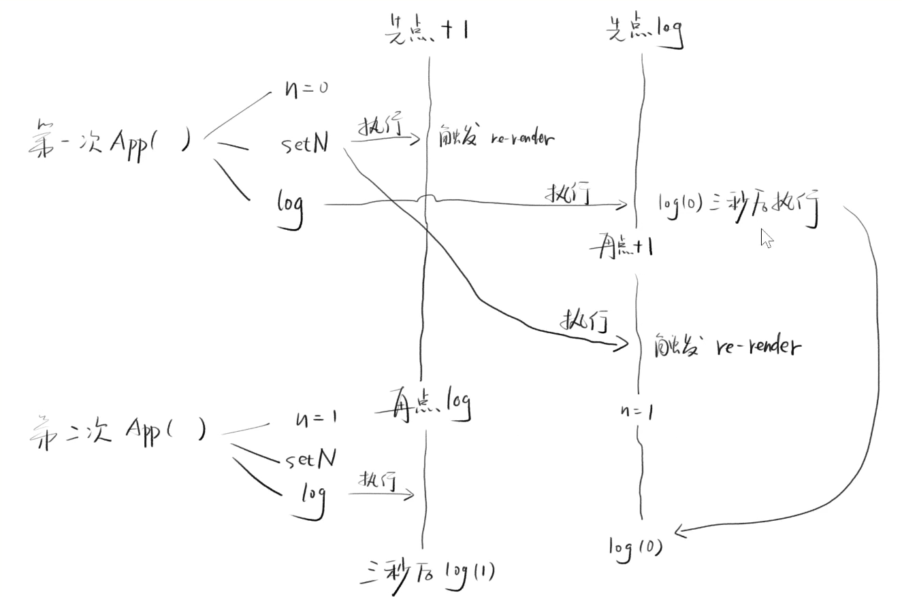

# useState 用法

### useState 使用
```js
export default function App() {
  console.log('App 运行了...')
  const [count, setCount] = React.useState(0);
  return (
    <div>
      <h1>{count}</h1>
      <button onClick={() => setCount(count + 1)}>increment</button>
    </div>
  );
}
```
1. 首次渲染 `render App`, 调用 `App()` -> 得到虚拟dom -> 创建真是 dom
2. 用户点击 button -> 调用 `setCount(count + 1)` -> 再次 `render App` -> 每次都会打印 -> 得到虚拟dom -> 和旧的虚拟dom作对比 `DOM diff` -> 更新

---

几个问题? 
- 执行`setCount`会发生什么? `count` 会变吗? `App()` 会重新执行吗?
- 如果 `App()` 重新执行, 那么 `useState(0)` 的时候, count 每次的值会有不同吗? // 会不同

分析

- `setCount` -> 数据存入 X
  - `setCount`一定会修改数据 x, 将`count + 1` 存入 x
  - `setCount`一定会触发`<App />` 重新渲染
- `useState` -> 读取 X 并赋值
  - `useState` 肯定会从 `x` 读取 `count` 最新值
- X ?
  - 每个组件有自己的数据 X, 我们将其命名为 `state`

### 尝试实现 useState
1. 初次
```js
/**
 * @params 初始值
 */
function myUseState(initialValue) {
  // 每次都为 初始值, 页面不会改变 
  let state = initialValue
  const setState = newValue => {
    // 让 state 修改为新的值
    state = newValue
    // 再次渲染
    render()
  }
  // 返回一个 [p1, p2]
  return [state, setState]
}


const render = () => {
  ReactDOM.render(<App />, document.getElementById('root'));
}

function App() {
  console.log('App 运行了...');
  const [count, setCount] = myUseState(0);
  return (
    <div>
      <h1>{count}</h1>
      <button onClick={() => setCount(count + 1)}>increment</button>
    </div>
  );
}
```

2. 把 state 提取为 全局变量
```js
/**
 * @params 初始值
 */
// set 一个 全局的 _state
let _state;
function myUseState(initialValue) {
  _state = _state === undefined ? initialValue : _state
  const setState = (newValue) => {
    _state = newValue;
    render();
  };
  return [_state, setState];
}

const render = () => {
  ReactDOM.render(<App />, document.getElementById('root'));
};

function App() {
  console.log('App 运行了...');
  const [count, setCount] = myUseState(0);
  return (
    <div>
      <h1>{count}</h1>
      <button onClick={() => setCount(count + 1)}>increment</button>
    </div>
  );
}
```

### 一个组件, 有两个 useState 怎么办?
- 对于上文中 2 实现的 `useState` 代码, 如果我们还有一个state `count1`, 两个共用一个 `_state`, 会冲突
- 所以我们尝试把`_state` 改为 数组 `_state = [0, 0]`

```js
/**
 * @params 初始值
 */
let _state = []
let index = 0
function myUseState(initialValue) {
  const currentIndex = index
  index += 1
  _state[currentIndex] = _state[currentIndex] === undefined ? initialValue : _state[currentIndex]
  const setState = (newValue) => {
    console.log(currentIndex)
    _state[currentIndex] = newValue;
    render();
  };
  return [_state[currentIndex], setState];
}

const render = () => {
  // index 重置
  index = 0
  ReactDOM.render(<App />, document.getElementById('root'));
};

function App() {
  console.log('App 运行了...');
  const [count, setCount] = myUseState(0);
  const [count1, setCount1] = myUseState(0);
  return (
    <div>
      <h1>{count}</h1>
      <h1>{count1}</h1>
      <button onClick={() => setCount(count + 1)}>increment</button>
      <button onClick={() => setCount1(count1 + 1)}>increment1</button>
    </div>
  );
}
```
- 数组方案的缺点
  - `useState` 的调用顺序不能乱 -> `顺序会改变下标`
- 现在代码还有一个问题? 
  - `App` 用了 `_state` 和 `index`, 其他组件用啥呢? -> 给每个组件创建一个 `_state index` 
  - 上面会产生其他问题,重名怎么办? -> 放在组件对应的虚拟节点对象上


### 总结
- 每个函数组件对应一个React节点
- 每个节点保存着 `state index`
- `useState` 会读取 `state[index]`
- `index` 由 `state` 出现顺序决定
- `setState` 会修改 `state`, 触发更新


### 问题展示
- 先log, 后+1, 有bug; 先+1,后 log, 无bug, 结果不同, 为什么 `log` 出旧数据
```js
import React from "react";
import ReactDOM from "react-dom";
const rootElement = document.getElementById("root");

function App() {
  const [n, setN] = React.useState(0);
  const log = () => setTimeout(() => console.log(`n: ${n}`), 3000);
  return (
    <div className="App">
      <p>{n}</p>
      <p>
        <button onClick={() => setN(n + 1)}>+1</button>
        <button onClick={log}>log</button>
      </p>
    </div>
  );
}

ReactDOM.render(<App />, rootElement);

```



### 面对上面有多个 n, 我们应该怎么做? 需要一个 始终的 变量  useRef
```js
function App() {
  const nRef = React.useRef(0);
  const log = () => setTimeout(() => console.log(`n: ${nRef.current}`), 1000);
  return (
    <div className="App">
      <p>{nRef.current} 这里并不能实时更新</p>
      <p>
        <button onClick={() => (nRef.current += 1)}>+1</button>
        <button onClick={log}>log</button>
      </p>
    </div>
  );
}
```
```js
// 上面的代码不能更新, 我们怎么让它更新
function App() {
  const nRef = React.useRef(0);
  // 配合 useState 使用
  const update = React.useState()[1];
  const log = () => setTimeout(() => console.log(`n: ${nRef.current}`), 1000);
  return (
    <div className="App">
      <p>{nRef.current} 这里并不能实时更新</p>
      <p>
        <button onClick={() => ((nRef.current += 1), update(nRef.current))}>
          +1
        </button>
        <button onClick={log}>log</button>
      </p>
    </div>
  );
}
```

### 除了 useRef , 还有 useContext -> 上下文
```js
// useContext 使用
import React from "react";
import ReactDOM from "react-dom";
import "./styles.css";
const rootElement = document.getElementById("root");

const themeContext = React.createContext(null);
function App() {
  const [theme, setTheme] = React.useState("red");
  return (
    // Provide 作用域从这里开始
    <themeContext.Provider value={{ theme, setTheme }}>
      <div className={`App ${theme}`}>
        <p>{theme}</p>
        <div>
          <ChildA />
        </div>
        <div>
          <ChildB />
        </div>
      </div>
    </themeContext.Provider>
  );
}

function ChildA() {
  const { setTheme } = React.useContext(themeContext);
  return (
    <div>
      <button onClick={() => setTheme("red")}>red</button>
    </div>
  );
}

function ChildB() {
  const { setTheme } = React.useContext(themeContext);
  return (
    <div>
      <button onClick={() => setTheme("blue")}>blue</button>
    </div>
  );
}

ReactDOM.render(<App />, rootElement);

```

### 总结
- 每次重新渲染, 组件函数就会执行
- 对应所有 state 都会出现分身
- 如果不希望出现分身, 使用 `useRef useContext`
